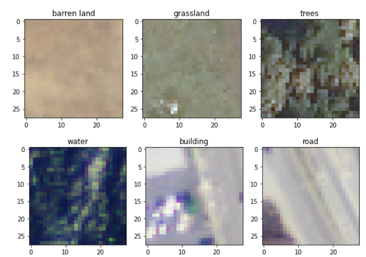

# Classifying DeepSat-6 Satellite Images Using Convolution Neural Networks

  

In this project, I’m using the DeepSat-6 satellite dataset which contains images extracted from the National Agriculture Imagery Program (NAIP) dataset to build a multi-class classification algorithm using convolution neural networks to assign a label for each image among several labels. The original dataset was extracted from [Kaggle](https://www.kaggle.com/crawford/deepsat-sat6).

The following files and folders are included in this repository: 

**Final Report and Slides:**
1) [Final Report](https://github.com/varsha2509/image-classification-cnn/blob/master/Docs/Report.pdf) 
    Report containing details on the data wranngling, exploratory data analysis, CNN models and summary.
2) [Slide Deck](https://github.com/varsha2509/image-classification-cnn/blob/master/Docs/Presentation.pdf)
    Powerpoint presentation with an overview of the project and findings.

**Google Colab Notebooks:**
1) [Loading Data](https://github.com/varsha2509/image-classification-cnn/blob/master/Colab/DeepSat6_LoadData.ipynb)
2) [Exploratory Data Analysis](https://github.com/varsha2509/Springboard-DS/blob/master/Capstone2/Colab/DeepSat6_ExploratoryDataAnalysis.https://github.com/varsha2509/image-classification-cnn/blob/master/Colab/DeepSat6_ExploratoryDataAnalysis.ipynb)
3) [Random Forest Classifier](https://github.com/varsha2509/image-classification-cnn/blob/master/Colab/DeepSat6_RandomForest.ipynb)
4) [Baseline CNN Model](https://github.com/varsha2509/image-classification-cnn/blob/master/Colab/DeepSat6_CNN.ipynb)
5) [Transfer Learning 1 (with padding)](https://github.com/varsha2509/image-classification-cnn/blob/master/Colab/%20DeepSat6_Vgg16_TL_Base_WithPadding.ipynb%20) 
6) [Transfer Learning 2 (with Upsampling)](https://github.com/varsha2509/image-classification-cnn/blob/master/Colab/DeepSat6_Vgg16_TL_Base_UpSampling.ipynb)
7) [Transfer Learning 3 (with fine tuning)](https://github.com/varsha2509/image-classification-cnn/blob/master/Colab/DeepSat6_Vgg16_FineTuning_WithPadding.ipynb)
8) [Model Comparison](https://github.com/varsha2509/image-classification-cnn/blob/master/Colab/DeepSat6_CNN_Model_Comparison.ipynb)

